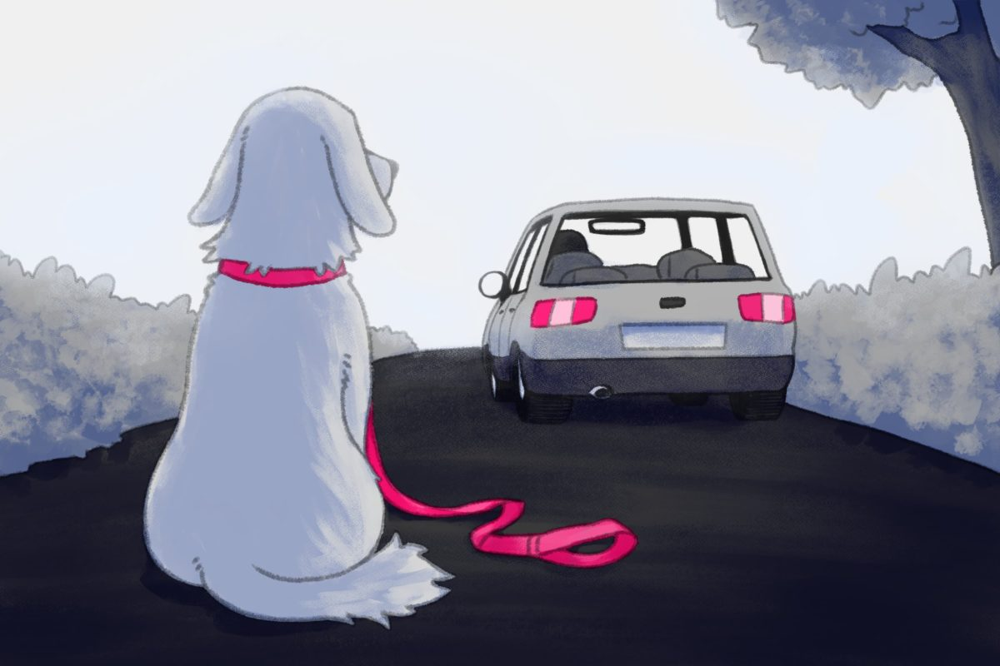

# Projeto: Pets Save




> De acordo com a Organização Mundial de Saúde (OMS), somente no Brasil, cerca de 30 milhões de animais estão abandonados, sendo aproximadamente 20 milhões de cães e 10 milhões de gatos. Em grandes metrópoles, para cada cinco habitantes há um cachorro. Desses, 10% estão abandonados (25 de mai. de 2022)

## 🏹 Alguns links importantes

*  Para acessar o Figma do Projeto (UI), *[Clique Aqui](https://www.figma.com/file/WQt0vSYlpgCy7tAJxBaBkr/Untitled?node-id=19-140&t=aJM6Si5DJetBYxu5-0)*

##	✨ Apresentações do nosso projeto:

* 💬 **ETAPA 1** (27/03) : Para acessar a apresentação do **STATUS REPORT** planejado para essa data acima, *[Clique Aqui](https://www.canva.com/design/DAFd3-qb92A/k-0rPFf4YmAYaVoamZkU9Q/edit)*

## 💻 Challenge Based Learning aplicado ao Projeto

* *Que big idea você propõe para o projeto?*:<br>Propomos como tema principal: `Adoção de animais de abrigo.`
* *Que questão essencial você propõe para o projeto?*:<br>Propomos como questão essencial: `Como conectar abrigos de animais com potenciais adotantes?`
* *Como você transforma a essential question e a big idea em um desafio similar a uma chamada para a ação?*:<br>Como um dos challanges para ajudar os animais em situação de rua, que resume a essencial question e a big idea, temos: `Ajudar a encontrar um lar para cada animal de estimação de abrigo, reduzindo o número de animais abandonados`

* *Que questões norteadoras você propõe para explorar e aprender mais sobre o desafio?*:<br>Questões-chaves: <br>`Como conectar abrigos e adotantes de forma eficaz?`<br>`Como garantir que os adotantes são confiáveis?`<br>`Como captar mais pessoas para utilizarem o aplicativo?`
* *Quais atividades e recursos norteadores você sugere para responder às questões norteadoras?*: <br>`Uma interface que conecta os dois lados da problemática: abrigos e adotantes.`
* *Quais os fundamentos que você aprendeu que nortearão as hipóteses de solução?*: <br>`ANALISAR OS FUNDAMENTOS`<br> `Metodologia Ágil (Iteração com o cliente)` <br> `Experiência de usuário (UX/UI)` <br> `MVP` <br> `Teste de Software`
* *Que solução você sugere para ser desenvolvida?*: <br>`Um aplicativo que ajuda a promover a adoção de animais de abrigo, conectando abrigos de animais e potenciais adotantes em uma plataforma fácil de usar e interativa.`
* *Como você testará a solução no mundo real?*: <br>`As ideias para teste são:` <br>`1: MVP, para validar a efetividade da solução.` <br>`2: Contato direto com um potencial cliente para servir de ponto de partida.`


### 👮 Ajustes e melhorias 

O projeto ainda está em desenvolvimento e as próximas atualizações serão voltadas nas seguintes tarefas:

- [ ] Tarefa x
- [ ] Tarefa y
- [ ] Tarefa z
- [ ] Tarefa w
- [ ] Tarefa v

## ☕ Usando o Pets Save

Para usar o site do **Pets Save**, siga estas etapas:

```
<exemplo_de_uso>
```


## 📫 Contribuindo para <nome_do_projeto>
<!---Se o seu README for longo ou se você tiver algum processo ou etapas específicas que deseja que os contribuidores sigam, considere a criação de um arquivo CONTRIBUTING.md separado--->
Para contribuir com <nome_do_projeto>, siga estas etapas:

1. Bifurque este repositório.
2. Crie um branch: `git checkout -b <nome_branch>`.
3. Faça suas alterações e confirme-as: `git commit -m '<mensagem_commit>'`
4. Envie para o branch original: `git push origin <nome_do_projeto> / <local>`
5. Crie a solicitação de pull.

Como alternativa, consulte a documentação do GitHub em [como criar uma solicitação pull](https://help.github.com/en/github/collaborating-with-issues-and-pull-requests/creating-a-pull-request).

## 🤝 Time de Desenvolvedores

Equipe de desenvolvimento do projeto de E.S:

<table>
  <tr>
    <td align="center">
      <a href="#">
        <br>
        <sub>
          <b>Luis Felipe Mota</b>
        </sub>
      </a>
    </td>
    <td align="center">
      <a href="#">
        <br>
        <sub>
          <b>Wilson Freitas</b>
        </sub>
      </a>
    </td>
    <td align="center">
      <a href="#">
        <br>
        <sub>
          <b>João Lucas</b>
        </sub>
      </a>
    </td>
  </tr>
</table>

[⬆ Voltar ao topo]()<br>
